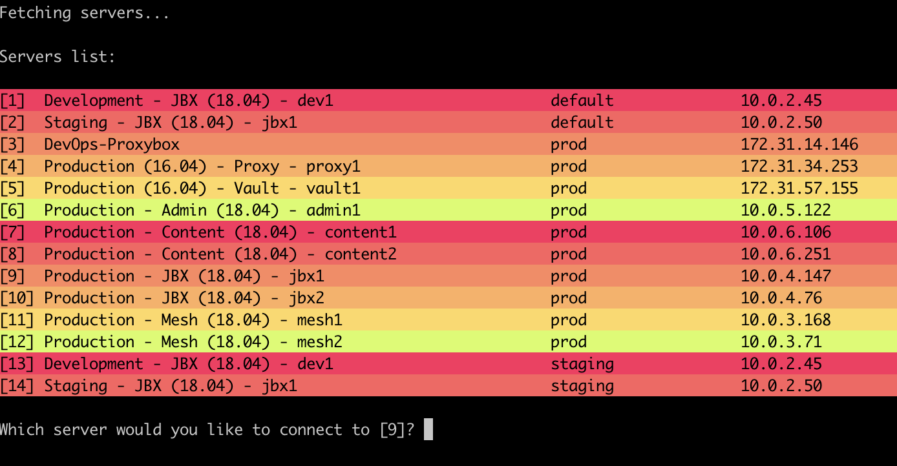

# SSH to Your EC2 Instance Instantly

SSH2 is an interactive command line tool which allows you to quickly ssh to an EC2 instance. You can select from a list of running servers under your account.



## Usage

```
$ ssh2 1
```

```
$ ssh2 -h
Usage: ssh2 [options] [server_number]
	server_number: a numeric value corresponding to the server number
	e.g.: 'ssh2 1' will ssh into the 1st server in the list.

Options:
  -h, --help            show this help message and exit
  -x, --bust-cache      refetch servers list from AWS
  -u USER, --user=USER  provide user (default: ubuntu)
  -i IDENTITY, --identity=IDENTITY
                        provide identity file
  -p PROFILE, --profile=PROFILE
                        provide aws profile
```

## Requirements

- [AWS CLI](https://aws.amazon.com/cli/)
- Python

## Installation

```
git clone https://github.com/Jumbleberry/ssh2.git
cd ssh2
ln -sf $(pwd)/ssh2 /usr/local/bin/
```

## Original Author

Soheil Yasrebi, [@soheil](https://twitter.com/soheil)

## Maintainers

- [Ian Elliott](https://github.com/Bellardia)
- [Alexander Hosking](https://github.com/ahosking)
